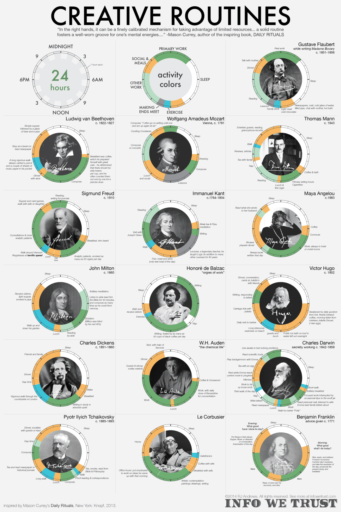
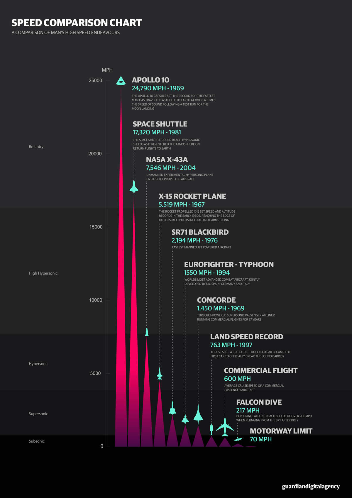

# Week 8 Blog Post - Data Visualization

### Creative Routines

Designed by RJ Andrews, this piece visualizes the daily routines of sixteen great creative minds from the 18th, 19th, and 20th centuries. Its success starts with its use of interesting and unique data. It provides a perspective on important figures that is rarely discussed, let alone compiled into a digestable format. This clarity is its second strength, as it is easy to gather a general understanding of the data with a quick glance. Activities are broken up into a few general categories - enough to give a good idea of how time was being spent, without becoming too specified. For a great depth, however, descriptions are provided next to nearly every block of time. These layers are accessible, but do not get in the way of the bigger picture, allowing the viewer to slowly work their way to a more detailed understanding of the visualization.

You can read more about the Creative Routines visualization [here](https://infowetrust.com/creative-routines/).

### Speed Comparison Chart

The sleek color scheme originally drew me to Jim Kynvin's Speed Comparison Chart. The dark background allows the graphic's primary information to truly pop, while also concealing further secondary information. This prevents the chart from becoming cluttered, while also providing more data for the viewer to discover. I personally found the use of triangles, instead of the typical rectangles, to convey relatvie speeds to be highly effective. It accentuates the high-velocity nature of the data, giving the illusion that the depicted vehicles (and one bird) are flying from the base at progressively faster speeds. The progressions of dark to warm colors as the speeds increase creates a similar effect.

See more of Jim's visualizations [here](http://isotype.co.uk).